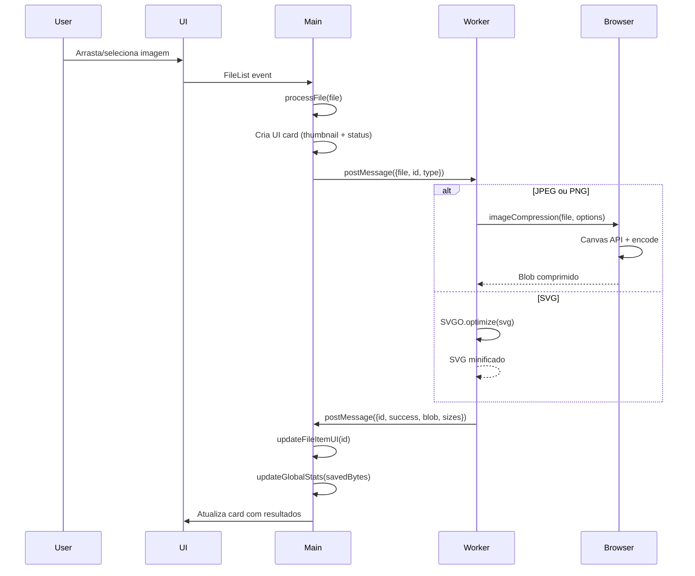

# Imaginizim

**Compressor de imagens 100% client-side usando tecnologia browser nativa**

Imaginizim é uma aplicação web que otimiza imagens (PNG, JPEG, SVG) diretamente no navegador, sem enviar dados para nenhum servidor. Todo o processamento é feito localmente usando APIs nativas do browser.

**Live Demo**: https://mafhper.github.io/imaginizim/  
**Repository**: https://github.com/mafhper/imaginizim

## Características Técnicas

- **100% Client-Side**: Nenhum dado é enviado para servidores. Todo processamento ocorre no navegador do usuário
- **Canvas API + Browser Compression**: Utiliza APIs nativas do browser para compressão de alta qualidade
- **Web Workers**: Processamento em thread separada para não bloquear a UI
- **Zero Dependências Backend**: Aplicação totalmente estática, pode ser hospedada em GitHub Pages ou qualquer CDN
- **Vite**: Build otimizado e desenvolvimento com HMR
- **Suporte Multi-formato**: PNG, JPEG e SVG

## Stack Tecnológica

### Frontend
- **Vite 7.2.4**: Build tool e dev server
- **Vanilla JavaScript (ES Modules)**: Sem frameworks, JavaScript puro
- **CSS Moderno**: Glassmorphism, gradientes, animações suaves

### Bibliotecas de Compressão
- **browser-image-compression**: Compressão de JPEG/PNG usando Canvas API
- **SVGO**: Minificação e otimização de SVG (carregado dinamicamente)

### Bibliotecas Auxiliares
- **JSZip**: Criação de arquivos ZIP para download em lote

## Estrutura do Projeto

```
imaginizim/
├── index.html              # Página HTML principal
├── style.css               # Estilos globais da aplicação
├── vite.config.js          # Configuração simplificada do Vite
├── package.json            # Dependências e scripts
├── src/
│   ├── main.js             # Lógica principal + gerenciamento de UI
│   └── worker.js           # Web Worker para processamento de imagens
└── public/                 # Assets estáticos (se houver)
```

## Fluxo de Funcionamento

### 1. Inicialização da Aplicação

```
index.html
    └─> main.js
          ├─> Cria Web Worker (worker.js)
          ├─> Configura event listeners (drag & drop, file input)
          └─> Inicializa UI (dropzone, modal, actions bar)
```

### 2. Upload e Processamento de Imagem



### 3. Download de Resultados

**Download Individual:**
```
User clica em botão "Download" do card
    └─> downloadFile(id)
          └─> URL.createObjectURL(blob)
              └─> Link temporário <a> com download automático
```

**Download em Lote (ZIP):**
```
User clica em "Download All (ZIP)"
    └─> Para cada imagem otimizada:
        └─> JSZip.file('nome', blob)
    └─> zip.generateAsync({type: 'blob'})
        └─> Download do arquivo ZIP
```

## Componentes Principais

### main.js

**Responsabilidades:**
- Gerenciamento de estado: Map de arquivos processados
- Event handling: Drag & drop, file input, clicks
- Comunicação com Worker: postMessage/onmessage
- Manipulação de DOM: Criar/atualizar cards de arquivo
- Modal de Preview: Visualização de imagens otimizadas
- Download: Individual e em lote (ZIP)

**Principais funções:**
```javascript
processFile(file)           // Envia arquivo para o worker
createFileItemUI(id, file)  // Cria card visual do arquivo
updateFileItemUI(id, data)  // Atualiza status do processamento
downloadFile(id)            // Download individual
openPreview(id)             // Abre modal de preview
```

### worker.js

**Responsabilidades:**
- Processamento de Imagens: Aplicação das bibliotecas de compressão
- Gerenciamento de tipos: JPEG/PNG vs SVG
- Tratamento de Erros: Captura e reporta falhas
- Comunicação Assíncrona: Retorna resultados via postMessage

**Configurações de Compressão:**

**JPEG:**
```javascript
{
  maxSizeMB: 1,
  maxWidthOrHeight: 1920,
  initialQuality: 0.75,
  fileType: 'image/jpeg'
}
```

**PNG:**
```javascript
{
  maxSizeMB: 1,
  maxWidthOrHeight: 1920,
  alwaysKeepResolution: true,
  initialQuality: 0.9,
  fileType: 'image/png'
}
```

**SVG:**
```javascript
{
  multipass: true,
  plugins: ['preset-default', 'removeDimensions']
}
```

## Debugging e Logs

### Filosofia de Logging

O código em produção mantém **logging mínimo** para melhor performance e código limpo:

**O que está logado:**
- ❌ Erros Críticos: Falhas no worker, erros de carregamento de bibliotecas
- ⚠️ Avisos: Problemas não-fatais que o usuário deve saber

**Logs Atuais**

**main.js:**
```javascript
// Apenas erros críticos
console.error('Failed to create worker:', error);
console.error('Worker error:', error.message);
console.error('Worker message error:', error);
```

**worker.js:**
```javascript
// Apenas falhas de carregamento
console.error('Failed to load SVGO:', e);
```

### Debugging Durante Desenvolvimento

Se precisar adicionar logs temporários durante desenvolvimento, use o padrão:
```javascript
// Desenvolvimento - remover antes do commit
if (import.meta.env.DEV) {
  console.log('Debug info:', data);
}
```

### Monitoramento de Erros

Para ambientes de produção, considere adicionar ferramentas como:
- **Sentry** - Rastreamento de erros em produção
- **LogRocket** - Sessões de usuário e debugging
- **Google Analytics** - Métricas de uso

### Browser DevTools

Use as ferramentas do navegador para debugging:
- **Console**: Erros críticos aparecem aqui
- **Network**: Verifique carregamento de arquivos WASM/SVGO
- **Application > Web Workers**: Monitore o worker
- **Performance**: Analise tempo de processamento

## Comandos

```bash
# Desenvolvimento (localhost:5173)
npm run dev

# Build para produção
npm run build

# Preview do build
npm run preview
```

## Configuração

### GitHub Pages

O projeto está configurado para deploy no GitHub Pages:
- Base URL: `/imaginizim/` (definido em `vite.config.js`)
- Branch de deploy: Geralmente `gh-pages` ou configuração via GitHub Actions

### Variáveis de Ambiente

```javascript
import.meta.env.BASE_URL  // Base URL da aplicação (/imaginizim/)
```

## Tecnologias Utilizadas vs Problemáticas

### Solução Atual
- **browser-image-compression**: Biblioteca pure-JavaScript que usa Canvas API
  - Funciona perfeitamente no browser
  - Sem problemas de polyfills ou WASM
  - Compressão de alta qualidade para JPEG e PNG

### Tentativas Anteriores (Abandonadas)
- **@wasm-codecs/mozjpeg**: Problemas com loading de arquivos WASM no Vite
- **@wasm-codecs/oxipng**: Erro "Dynamic require of 'util' is not supported"
  - Dependências Node.js incompatíveis com workers
  - Polyfills complexos não resolveram

## Notas de Desenvolvimento

1. Simplicidade: Usar bibliotecas nativas do browser quando possível
2. Worker Format: `format: 'es'` para módulos ES no worker
3. Base URL: Sempre usar `import.meta.env.BASE_URL` para paths dinâmicos
4. Logs: Prefixos emoji facilitam filtro no console
5. Download: Usar `URL.createObjectURL()` e revocar após uso

## Características da UI

- Drag & Drop: Interface intuitiva para upload
- Preview Modal: Visualização antes e depois
- Progress Tracking: Status em tempo real
- Batch Download: Download múltiplo em ZIP
- Estatísticas: Total economizado em KB/MB
- Design Moderno: Glassmorphism, gradientes, animações

## Licença

Este projeto é open source e está disponível para uso livre.

---

**Desenvolvido com ❤️ usando tecnologias web modernas e MUITA persistência no debugging! 🐛**
